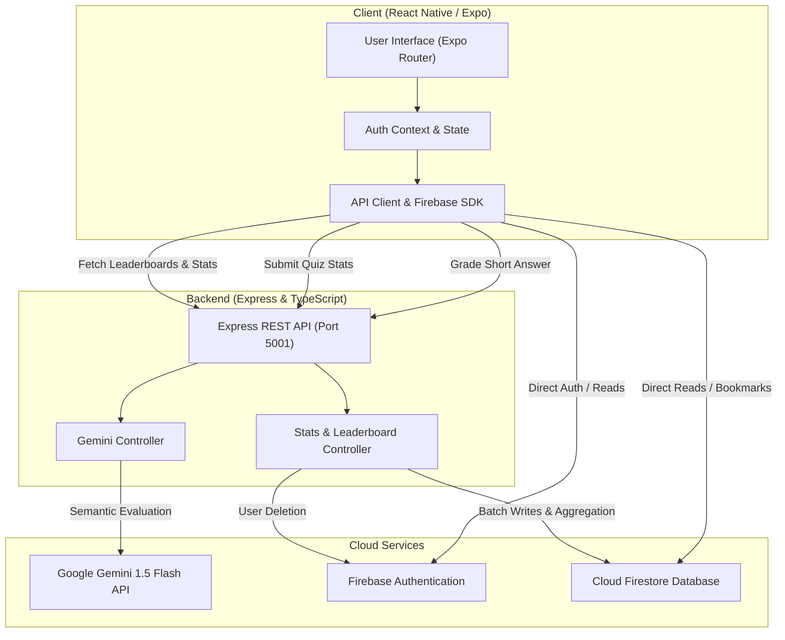

# 🎓 QuizMaster

[](https://reactnative.dev/)
[](https://expo.dev/)
[](https://www.typescriptlang.org/)
[](https://nodejs.org/)
[](https://expressjs.com/)
[](https://firebase.google.com/)
[](https://ai.google.dev/)
[](LICENSE)

> A full-stack, AI-powered academic quiz and assessment application built with **React Native (Expo)** and **Node.js / Express**, featuring intelligent short-answer semantic evaluation via **Google Gemini 1.5 Flash** and real-time data persistence with **Firebase (Auth & Firestore)**.

---

## 📖 Table of Contents

- [Overview](#-overview)
- [Key Features](#-key-features)
- [Architecture & Tech Stack](#-architecture--tech-stack)
- [System Architecture](#-system-architecture)
- [Repository Structure](#-repository-structure)
- [Getting Started](#-getting-started)
  - [Prerequisites](#prerequisites)
  - [1. Clone Repository](#1-clone-repository)
  - [2. Firebase Configuration](#2-firebase-configuration)
  - [3. Backend Setup (`server`)](#3-backend-setup-server)
  - [4. Database Seeding](#4-database-seeding)
  - [5. Mobile App Setup (`client`)](#5-mobile-app-setup-client)
- [REST API Endpoints](#-rest-api-endpoints)
- [Firestore Data Schema](#-firestore-data-schema)
- [Roles & Permissions](#-roles--permissions)
- [Troubleshooting & FAQs](#-troubleshooting--faqs)
- [License](#-license)

---

## 🌟 Overview

**QuizMaster** is designed to modernize academic testing by bridging multiple-choice assessments with descriptive, short-answer evaluations. Traditional quiz platforms restrict assessments to static MCQs due to the difficulty of automated descriptive grading. QuizMaster solves this by using **Google Gemini 1.5 Flash** to semantically grade short answers against reference conceptual rubrics in real-time, providing concise feedback to learners while maintaining a human-in-the-loop manual review interface for educators and admins.

---

## ✨ Key Features

### 🧠 AI-Powered Short-Answer Grading
- **Semantic Understanding**: Uses Google Gemini 1.5 Flash to evaluate student responses conceptually rather than through rigid string matching.
- **Tolerant & Fair**: Forgives minor spelling typos and phrasing differences while strictly checking for core concepts.
- **Immediate Feedback**: Generates clear, pedagogical feedback (under 20 words) explaining why an answer is correct or what key concept was missed.
- **Fallback Resilience**: In the event of network or AI service interruptions, responses are flagged and gracefully queued for administrator review without interrupting the quiz flow.

### 📝 Comprehensive Assessment Engine
- **Mixed Question Types**: Supports both **Multiple Choice Questions (MCQ)** (1 mark) and **Short Answer** questions (5 marks).
- **Custom Time Limits**: Configurable quiz duration timers with auto-submit upon expiration.
- **Instant Result Breakdown**: Comprehensive scorecard displaying total score, percentage, earned marks, and review breakdowns for each question.
- **Community Question Insights**: View post-quiz statistical distributions showing the percentage of all users who chose each option and global question success rates.

### 🏆 Competitive Leaderboards & Analytics
- **Global Leaderboard**: Real-time ranking based on overall average scores and total quizzes completed.
- **Category Leaderboards**: Filter rankings by subject category (e.g., Physics, Chemistry, Math, Computer Science) based on subject-specific mastery.
- **Personal Performance Analytics**: Track category-by-category score averages, total attempts, and historical growth.

### 🔖 Bookmarks & Study Tools
- **Question Bookmarks**: Save challenging questions directly from quiz sessions or review screens.
- **Study Vault**: Review bookmarked questions categorized with full explanations and reference answers for targeted revision.
- **Detailed History**: Browse historical quiz attempts with timestamped scorecards.

### 🛡️ Robust Admin Dashboard
- **Category Management**: Create, edit, and delete quiz categories and adjust default timer durations.
- **Question Bank CRUD**: Add, edit, or remove MCQs and Short-Answer questions dynamically.
- **Human-in-the-Loop Review**: Dedicated portal for administrators to inspect student submissions, manually adjust marks, and override automated AI grading.
- **User Management**: Inspect registered users and perform cascading deletions across Firebase Auth, user profiles, and associated quiz attempt records.

---

## 🛠 Architecture & Tech Stack

| Layer | Technology | Purpose |
|---|---|---|
| **Mobile Frontend** | **React Native (0.81.4)** + **React 19** | Cross-platform native mobile interface |
| **Framework & Router** | **Expo SDK 54** + **Expo Router v6** | File-based routing, deep linking, native compilation |
| **Styling & UI** | **Expo Linear Gradient**, **Lucide Icons** | Modern dark-first design system with responsive card layouts |
| **Client Storage** | **AsyncStorage** | Local persistence for Firebase Auth sessions and bookmarks |
| **Backend Server** | **Node.js** + **Express.js 4** | RESTful API server for AI grading and aggregated stats |
| **Language** | **TypeScript 5** | Strict end-to-end type safety |
| **AI Evaluation Engine** | **Google Gemini 1.5 Flash** (`@google/generative-ai`) | Real-time semantic grading and pedagogical explanations |
| **Authentication** | **Firebase Authentication** | Secure email/password login and user identity management |
| **Database** | **Cloud Firestore** | Real-time NoSQL storage for questions, categories, stats, and history |
| **Admin SDK** | **Firebase Admin SDK (v12)** | Privileged server-side Firestore batch operations and Auth management |

---

## 📐 System Architecture



---

## 📂 Repository Structure

```
QuizMaster/
├── client/                              # React Native / Expo Frontend
│   ├── assets/                          # App icons, splash screens, and images
│   ├── src/
│   │   ├── app/                         # Expo Router file-based pages
│   │   │   ├── (auth)/                  # Auth screens
│   │   │   │   ├── login.tsx            # User sign in
│   │   │   │   └── register.tsx         # User registration
│   │   │   ├── (tabs)/                  # Bottom tab navigation
│   │   │   │   ├── admin/
│   │   │   │   │   └── dashboard.tsx    # Admin portal (Categories, Questions, Reviews, Users)
│   │   │   ├── profile/
│   │   │   │   │   ├── bookmarks.tsx    # Bookmarked questions
│   │   │   │   │   └── history.tsx      # Past quiz attempt records
│   │   │   │   ├── quiz/
│   │   │   │   │   └── result.tsx       # Quiz results scorecard & question stats
│   │   │   │   ├── categories.tsx       # Category selection grid
│   │   │   │   ├── index.tsx            # Home screen (Stats, Recent Quizzes, Quick Play)
│   │   │   │   ├── leaderboard.tsx      # Global & category leaderboards
│   │   │   │   └── profile.tsx          # User profile & stats
│   │   │   ├── quiz/
│   │   │   │   └── [categoryId].tsx     # Active interactive quiz runner
│   │   │   └── _layout.tsx              # Root stack navigation layout
│   │   ├── components/                  # Reusable UI widgets & themes
│   │   ├── constants/                   # Theme color palette, spacing, and typography
│   │   ├── context/
│   │   │   └── AuthContext.tsx          # Firebase Auth listener & user profile state
│   │   ├── hooks/                       # Custom hooks (theming, color scheme)
│   │   └── services/
│   │       ├── api.ts                   # REST API client (dynamic IP resolution)
│   │       └── firebase.ts              # Firebase client SDK initialization
│   ├── app.json                         # Expo configuration
│   ├── package.json                     # Client dependencies & scripts
│   └── tsconfig.json                    # Client TypeScript config
│
├── server/                              # Node.js + Express Backend
│   ├── src/
│   │   ├── config/
│   │   │   └── firebase.ts              # Firebase Admin SDK initialization
│   │   ├── controllers/
│   │   │   ├── geminiController.ts      # Google Gemini 1.5 Flash grading logic
│   │   │   └── statsController.ts       # Quiz stats submission, leaderboard, user admin
│   │   ├── index.ts                     # Express server setup and routes
│   │   └── seed.ts                      # Firestore database seeder script
│   ├── questions.json                   # Curated questions database for seeding
│   ├── package.json                     # Server dependencies & scripts
│   └── tsconfig.json                    # Server TypeScript config
│
├── .gitignore                           # Git ignore rules
└── README.md                            # Project documentation
```

---

## 🚀 Getting Started

### Prerequisites

Ensure you have installed:
- **Node.js** (v18.x or higher)
- **npm** (v9.x or higher)
- **Git**
- **Expo Go** app installed on your physical mobile device ([Android](https://play.google.com/store/apps/details?id=host.exp.exponent) / [iOS](https://apps.apple.com/app/expo-go/id982107779)), or an **Android Emulator / iOS Simulator**.

---

### 1. Clone Repository

```bash
git clone https://github.com/code-with-nazmul/QuizMaster.git
cd QuizMaster
```

---

### 2. Firebase Configuration

1. Go to the [Firebase Console](https://console.firebase.google.com/) and create a new project.
2. Enable **Firebase Authentication** (Email/Password provider).
3. Create a **Cloud Firestore** database (in test or production mode).
4. Register a **Web App** in your Firebase project and copy the config credentials.
5. In Firebase Project Settings, navigate to **Service Accounts**, click **Generate new private key**, and save the downloaded JSON file as `server/serviceAccountKey.json`.

---

### 3. Backend Setup (`server`)

1. Open a terminal and navigate to the `server` directory:
   ```bash
   cd server
   ```

2. Install dependencies:
   ```bash
   npm install
   ```

3. Create an environment configuration file `.env` in the `server` folder:
   ```env
   PORT=5001
   GEMINI_API_KEY=your_google_gemini_api_key_here
   ```
   > 🔑 Get your Gemini API key from [Google AI Studio](https://aistudio.google.com/).

4. Place your Firebase service account key in:
   ```
   server/serviceAccountKey.json
   ```

5. Start the backend development server:
   ```bash
   npm run dev
   ```
   *The server will start on `http://localhost:5001`.*

---

### 4. Database Seeding

QuizMaster includes a seeder script that imports questions from `server/questions.json` into Firestore with automatic duplicate prevention:

```bash
cd server
npm run seed
```

> **Note:** The seeder matches categories by name. Ensure categories (e.g., Physics, Chemistry, Mathematics, Computer Science) are either created via the Admin Dashboard or present in Firestore before seeding.

---

### 5. Mobile App Setup (`client`)

1. Open a new terminal and navigate to the `client` directory:
   ```bash
   cd client
   ```

2. Install client dependencies:
   ```bash
   npm install
   ```

3. Configure Firebase Client (`client/src/services/firebase.ts`):
   Ensure the `firebaseConfig` object matches your Firebase project credentials:
   ```typescript
   const firebaseConfig = {
     apiKey: "YOUR_API_KEY",
     authDomain: "YOUR_PROJECT_ID.firebaseapp.com",
     projectId: "YOUR_PROJECT_ID",
     storageBucket: "YOUR_PROJECT_ID.firebasestorage.app",
     messagingSenderId: "YOUR_MESSAGING_SENDER_ID",
     appId: "YOUR_APP_ID"
   };
   ```

4. **Network Configuration**:
   - `client/src/services/api.ts` automatically uses `expo-constants` to detect your computer's local network IP when running on a physical device with **Expo Go**.
   - For Android emulators, it falls back to `http://10.0.2.2:5001`.
   - Ensure your mobile phone and development machine are connected to the **same Wi-Fi network**.

5. Start the Expo development server:
   ```bash
   npx expo start
   ```

6. Open the app:
   - **Physical Device**: Scan the QR code displayed in the terminal using the Expo Go app.
   - **Android Emulator**: Press `a` in the terminal.
   - **iOS Simulator**: Press `i` in the terminal.
   - **Web Browser**: Press `w` in the terminal.

---

## 📡 REST API Endpoints

The Express server exposes the following endpoints:

| Method | Endpoint | Description | Request Body / Params |
|---|---|---|---|
| `GET` | `/health` | Health check endpoint | None |
| `POST` | `/api/grade-short-answer` | Evaluates a short answer using Gemini 1.5 Flash | `{ questionText, correctAnswer, userAnswer }` |
| `POST` | `/api/submit-quiz-stats` | Submits quiz results, updates question stats & leaderboards | `{ userId, categoryId, categoryName, answers, score, totalQuestions, totalPossibleMarks }` |
| `GET` | `/api/questions/:questionId/stats` | Fetches aggregate attempt and option distribution stats | `questionId` (path param) |
| `GET` | `/api/leaderboard` | Fetches top 20 ranked users (global or category) | `?category=Physics` (optional query param) |
| `DELETE` | `/api/admin/users/:userId` | Cascading user deletion (Auth, Firestore, History) | `userId` (path param) |

---

## 🗄 Firestore Data Schema

### 1. `users` Collection
```typescript
{
  uid: string;
  displayName: string;
  email: string;
  photoURL: string;
  totalQuizzes: number;
  averageScore: number;
  isAdmin?: boolean;
  categoryPerformance?: {
    [categoryName: string]: {
      correct: number;
      total: number;
    };
  };
  createdAt: Timestamp;
}
```

### 2. `categories` Collection
```typescript
{
  name: string;             // e.g. "Computer Science"
  description: string;      // Category summary
  timeLimitSeconds: number; // e.g. 300 (5 minutes)
  createdAt: Timestamp;
}
```

### 3. `questions` Collection
```typescript
{
  categoryId: string;
  categoryName: string;
  type: "MCQ" | "ShortAnswer";
  questionText: string;
  options?: string[];       // MCQ only: Array of choices
  correctAnswer: string;    // Correct option string or reference answer
  marks: number;            // 1 for MCQ, 5 for Short Answer
  createdAt: Timestamp;
}
```

### 4. `quiz_history` Collection
```typescript
{
  userId: string;
  categoryId: string;
  categoryName: string;
  score: number;
  totalQuestions: number;
  totalPossibleMarks: number;
  percentage: number;
  answers: Array<{
    questionId: string;
    type: "MCQ" | "ShortAnswer";
    selectedAnswer?: string;
    userAnswerText?: string;
    isCorrect: boolean;
    marksAwarded: number;
    explanation?: string;
  }>;
  timestamp: Timestamp;
}
```

### 5. `question_stats` Collection
```typescript
{
  totalAttempts: number;
  correctAttempts: number;
  optionCounts?: { [sanitizedOption: string]: number };
  updatedAt: Timestamp;
}
```

---

## 👑 Roles & Permissions

- **Standard Student / Learner**:
  - Sign up & authenticate via email/password.
  - Browse categories and take timed quizzes.
  - Submit answers for automated AI evaluation.
  - View individual results, answer keys, and statistical option distributions.
  - Bookmark questions and review quiz attempt history.
  - Compete on global and category leaderboards.

- **Administrator**:
  - All student privileges.
  - Set `isAdmin: true` on the user's document in the `users` Firestore collection.
  - Access the dedicated **Admin Dashboard**:
    - Manage categories and quiz time limits.
    - Create, modify, and delete questions from the question bank.
    - Review and adjust short-answer grades submitted by students.
    - View and delete registered user accounts.

---

## ❓ Troubleshooting & FAQs

<details>
<summary><b>1. How do I make a user an Admin?</b></summary>
Open your Firebase Console, navigate to <b>Cloud Firestore</b> &rarr; <code>users</code> collection &rarr; locate the user's document ID &rarr; add a boolean field <code>isAdmin</code> with value <code>true</code>. The next time the user opens the app, the Admin tab and management features will be unlocked.
</details>

<details>
<summary><b>2. Network request failed when running on Expo Go</b></summary>
Ensure your phone and computer are on the same Wi-Fi network. Check that your computer's firewall allows incoming connections on port <code>5001</code>. The app uses <code>expo-constants</code> to dynamically identify your machine's local IP address.
</details>

<details>
<summary><b>3. Gemini API returns 429 or quota errors</b></summary>
Verify that your Gemini API key in <code>server/.env</code> has sufficient quota in Google AI Studio. If the API key is invalid or quota is exceeded, the server will log the error and short-answer questions will automatically fallback to queued manual admin review.
</details>

<details>
<summary><b>4. How do I add new questions?</b></summary>
You can add questions either directly through the <b>Admin Dashboard</b> inside the app or by appending items to <code>server/questions.json</code> and running <code>npm run seed</code> in the <code>server</code> directory.
</details>

---

## 📄 License

This project is licensed under the [MIT License](LICENSE) - see the LICENSE file for details.

---

<p align="center">
  Built with ❤️ for Mobile Application Development
</p>
